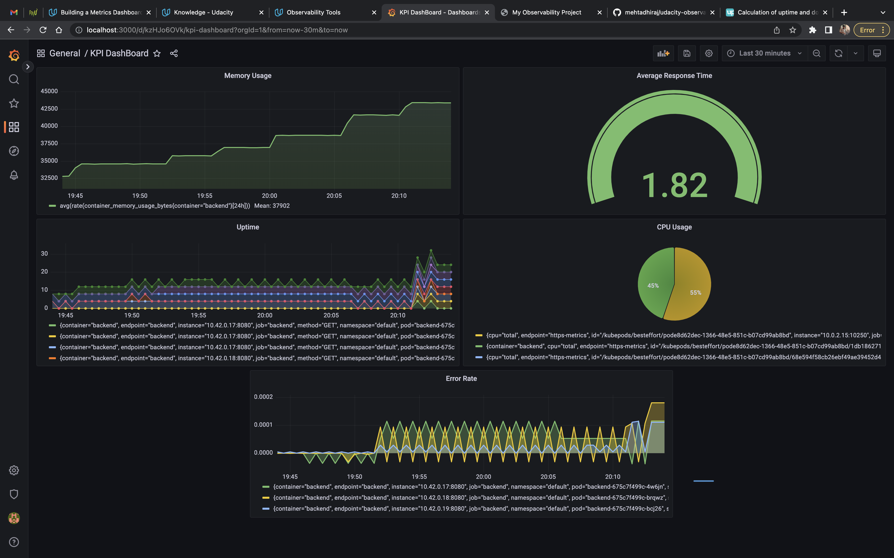

**Note:** For the screenshots, you can store all of your answer images in the `answer-img` directory.

## Verify the monitoring installation

## Setup the Jaeger and Prometheus source

## Create a Basic Dashboard

## Describe SLO/SLI
- **SLO** - It stands for Service Level Objectives. It help us define the targets of non functional requirement for the given services. eg. - We can target for a monthly uptime of 99.9%. So, monthly uptime can be our SLO. 
- **SLI** - It stands for Service Level Indicator. With this we can keep a track of how efficiently are we able to achieve our SLOs. eg. - For monthly uptime SLO if we are not able to achieve 99.9% hence this is an indicator that we need to improve our service or we need to revisit our SLO. 

## Creating SLI metrics.
* Error Rate
* Latency
* Uptime / Availability
* Throughput
* Response Time

## Create a Dashboard to measure our SLIs

## Tracing our Flask App

## Jaeger in Dashboards

## Report Error
TROUBLE TICKET

Name: Error 500 on hitting /trace

Date: 5 Nov 2022

Subject: 500 error on hitting /trace of trial service

Affected Area: Trial Service

Severity: Medium

Description: On hitting /trace of trial service we encountered 500 internal server error. This was found around 5 Nov 2022, 10:30 pm.

## Creating SLIs and SLOs
SLOs:
1. 99% of availability per month
2. Maximum latency of application should not exceed 1500 ms per month.
3. CPU usage should not be more that 70% per month
4. Memory usage should not go more than 600Mb per month.

SLIs:
1. 20x or 30x responses of the service for the month is 98.95%.
2. Average latency of requests is 1037ms for the month.
3. Average CPU usage by the services is 40.90% for the month
4. Average memory usage by the application is 247Mib for the month.

## Building KPIs for our plan
1. 20x or 30x responses of the service for the month is 98.95%
    - uptime per month - We can determine the usability of service with this KPI.
    - success response - KPI help us indicate the availability of the services.

2. Average latency of requests is 1037ms for the month.
    - latency - average response time of the application can be indicated from this KPI.
    - traffic - number of request served by the application can be indicated by this KPI

3. Average CPU usage by the services is 40.90% for the month
    - cpu usage - CPU used by the pod for a given service can be indicated by this KPI.
    - limit - we can identify if service is exceeding the alloted resources with the help of this KPI 

4. Average memory usage by the application is 247Mib for the month.
    - memory usage - memmory usage used by the pod for a given service can be indicated by this KPI.
    - limit - we can identify if service is exceeding the alloted resources with the help of this KPI 

## Final Dashboard

- Uptime panel - this says about the successful responses from the service.
- Average Response Time panel - average response time of the service per request is represented in this panel.
- CPU Usage panel - CPU usage of the service can be represented in this panel.
- Memory Usage panel - memory usage of the service can be represented in this panel.
- Error rate panel - error responses of the application.